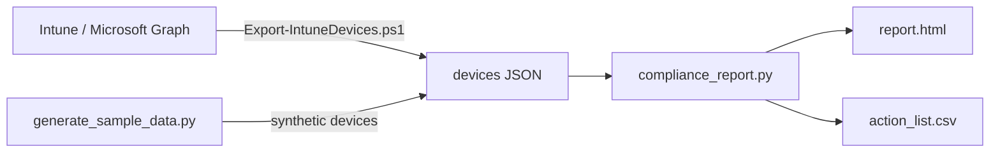

# Intune Device Compliance Report

A lightweight report that turns an Intune device export into a clear view of endpoint compliance: what share of devices is compliant, which ones need action, and why.

Built with Python (standard library only) and PowerShell. The repo includes a generator for **synthetic** data, so you can try it without access to a tenant.

## The problem

The Intune admin center shows compliance, but the people who need to act on it (service desk leads, site IT, managers) usually want something simpler: one page with the numbers and a list of devices to chase. Building that by hand from exports every week takes time and is easy to get wrong.

This tool answers four questions in one report:

- What percentage of our managed devices is compliant, overall and per operating system?
- Which devices are non-compliant or not encrypted?
- Which devices have stopped checking in (lost, spare, off-network)?
- Which OS versions are still in use?

## What it produces

- **`report.html`**: a single-file report with KPI tiles, compliance by OS, the devices that need action (with the reason for each) and OS versions in use. Works offline and supports light and dark mode.
- **`action_list.csv`**: the same device list, ready to filter in Excel or import into a ticketing tool.

Devices are flagged for:

| Issue | Rule |
|---|---|
| Non-compliant | `complianceState` is noncompliant, conflict or error |
| Not encrypted | `isEncrypted` is false |
| No recent sync | last check-in older than the threshold (14 days by default) |
| In grace period | `complianceState` is inGracePeriod |
| Unknown state | any other state |

## How it works



## Try it with sample data

Requires Python 3.10 or later. No extra packages needed.

```bash
git clone https://github.com/inigogonzalezgarcia/02-intune-compliance-report.git
cd 02-intune-compliance-report
python generate_sample_data.py
python compliance_report.py sample_data/managed_devices.json
```

Open `output/report.html` in your browser.

Options:

```bash
python compliance_report.py devices.json --stale-days 30 --out-dir reports --title "Madrid office - devices"
```

## Use it with your own tenant

1. Install the Microsoft Graph PowerShell SDK (once):
   ```powershell
   Install-Module Microsoft.Graph.DeviceManagement -Scope CurrentUser
   ```
2. Export your devices. You sign in with your own account; the script only asks for the read-only permission `DeviceManagementManagedDevices.Read.All`:
   ```powershell
   .\scripts\Export-IntuneDevices.ps1 -OutputPath .\intune_devices.json
   ```
3. Build the report:
   ```bash
   python compliance_report.py intune_devices.json
   ```

The export contains user and device names, so keep it and the generated report inside your organisation. Both are excluded from Git by `.gitignore`.

## Tests

```bash
pip install pytest
python -m pytest
```

## Next steps

- Group results by site or department (from device name prefixes or Entra ID attributes).
- Track the compliance rate over time from successive exports.
- Optional email summary for the weekly service review.

## Background

Inspired by years of end-user support and device management in multinational environments, where a simple, trusted view of device health makes service reviews much shorter. Built from scratch with synthetic data; no employer code or data is used.

## Customisation and contact

Need a version adapted to your environment (different rules, your own branding, extra data sources or a scheduled weekly report)? Get in touch:

- Email: [inigogonzalezgarcia@yahoo.es](mailto:inigogonzalezgarcia@yahoo.es)
- LinkedIn: [linkedin.com/in/igonzalez93](https://www.linkedin.com/in/igonzalez93)

## License

MIT
